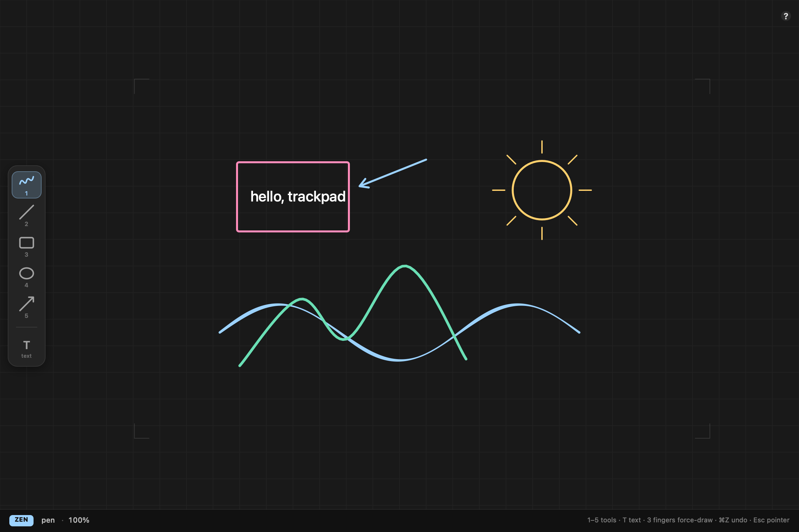
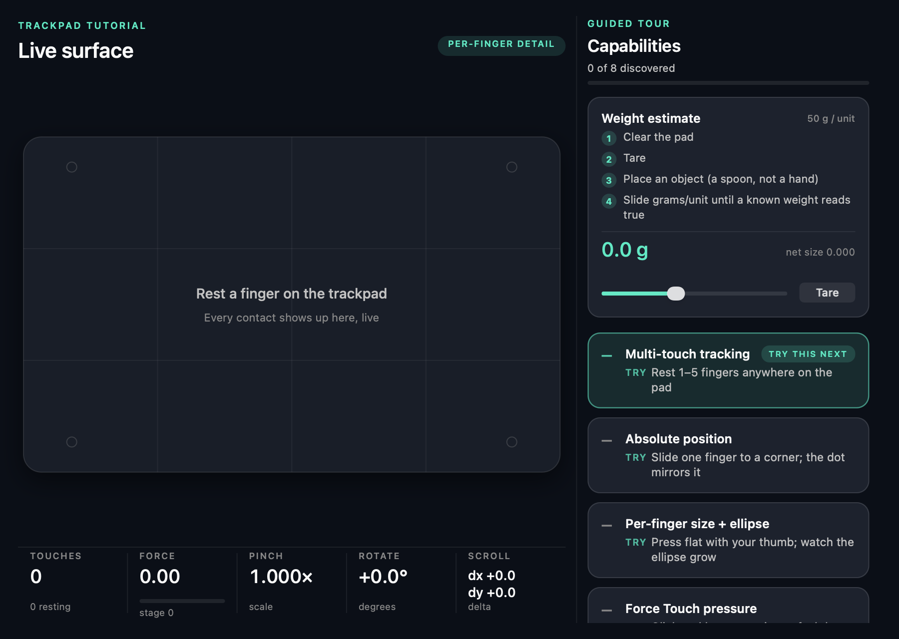

# Trackpad Studio

**Your Mac trackpad is a pressure-aware multi-touch canvas. This app proves it.**

Draw with your fingers at absolute trackpad positions, feel force change your ink,
zoom and pan in a single two-finger gesture, and explore everything the trackpad
can secretly do — including weighing things (really).

**Website:** [canvas.zaynjarvis.com](https://canvas.zaynjarvis.com) ·
**Support:** [Buy me a coffee ☕](https://buymeacoffee.com/zaynjarvis?status=1)



## Why a native Mac app

Browsers can't see trackpad touches at all — to the web platform a trackpad is
just a relative mouse (pinch arrives as ctrl+wheel, force only in Safari during
clicks, zero per-finger data). Absolute-position finger drawing needs AppKit's
`NSTouch` API, Force Touch pressure events, and (optionally) the private
MultitouchSupport framework for per-finger contact size.

## Features

- **Zen mode** — the system cursor freezes and hides while you draw; your
  fingers own the canvas. `Esc` toggles back to normal pointing, and the app
  guarantees your cursor is restored on focus loss, view teardown, and quit.
- **Absolute finger drawing** — the on-screen corner brackets mirror the
  physical pad; anything capacitive can draw.
- **Force-aware ink** — light touch is a hovering cursor, a click draws, and
  Force Touch pressure drives stroke width.
- **Unified pinch + pan** — computed from raw two-finger touches (centroid pan,
  distance-ratio zoom anchored at the centroid), bypassing macOS gesture
  exclusivity: you can zoom while panning in one continuous gesture.
- **Three-finger force draw** — three-finger drag executes the current tool at
  full force; the leftmost finger is the pen and stays the pen until release.
- **Tools 1–5** — pen, line, rectangle, ellipse, arrow in an always-visible left
  toolbar with active highlight. `T` drops one-shot text that keeps a constant
  on-screen size at any zoom, then hands the pen back.
- **Guided tutorial** (`⌘T` or the `?` button) — 8 trackpad capabilities as
  tutorial cards with live ✓ discovery, plus a weight-estimate card that turns
  the pad into a rough gram scale via capacitive contact size.
- **Palm-safe** — resting thumbs/palms are filtered out of every gesture and
  rendered as faint ghost rings.



## Install

```bash
git clone https://github.com/ZaynJarvis/trackpad-studio
cd trackpad-studio
swift run TrackpadStudio
```

Requires macOS 13+ and Swift 5.9+ (Xcode command line tools).

## Controls

| Input | Action |
|---|---|
| 1 finger | cursor; draws while clicked (or on firm touch when per-finger data is available) |
| 2 fingers | pan + zoom simultaneously |
| 3 fingers | force-draw with the current tool (leftmost finger is the pen) |
| `1`–`5` | select tool |
| `T` | one-shot text at the cursor |
| `⌘Z` / `⌘⌫` | undo / clear |
| `Esc` | toggle Zen ⇄ Pointer mode |
| `⌘T` / `?` | open the trackpad tutorial |

## Weight scale & per-finger detail

Per-finger contact size/ellipse (and therefore the weight estimate and
click-free force drawing) uses the private `MultitouchSupport.framework`,
loaded at runtime with a graceful fallback. On modern macOS the data stream
requires **Input Monitoring** permission for the launching app (System
Settings → Privacy & Security → Input Monitoring). Everything else works
without it. The gram scale is a calibratable party trick, not a measuring
instrument.

## Architecture

Plain Swift Package Manager executable — no Xcode project, no dependencies.

```
Sources/TrackpadStudio/
  TrackpadCore.swift      shared input model + touch-capture view
  MultitouchBridge.swift  private-framework reader (dlopen, safe fallback)
  BoardTab.swift/.Model   the canvas: modes, gestures, tools, rendering
  CapabilityTab.swift     the guided tutorial / live instrument panel
  AppShell.swift          window, menu, tutorial panel, --snapshot mode
Sources/CMultitouchShim/  C struct layout for the private framework
```

`TrackpadStudio --snapshot <dir>` renders marketing screenshots of its own
windows (no screen-recording permission needed).

## License

[MIT](LICENSE) © Zayn Jarvis

If this made your trackpad more fun, consider
[buying me a coffee ☕](https://buymeacoffee.com/zaynjarvis?status=1).
